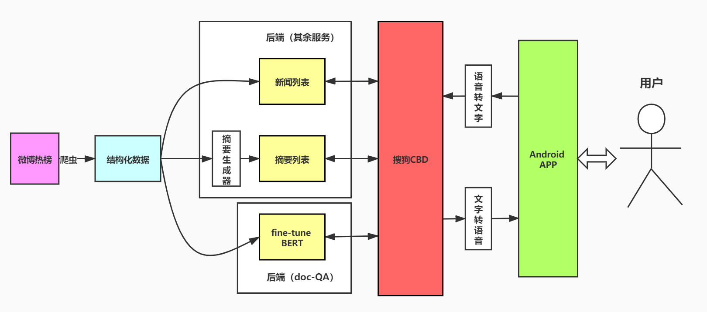

<center>
<hr>
<h1>
搜热狗 项目文档
</h1>
    叶泽阳 计71 2017013567<br>
    郭诚 计75 2016010563<br>
</center>

## 目录


[TOC]


## 项目介绍

#### 项目基本情况

​		该项目名为“搜热狗”，项目产品是一个热点新闻语音交互的Android端手机助手。

<div  align="center">    
	<br>
    <font size="2" color="grey">产品界面</font>
</div>

#### 功能介绍

​		交互方式简单，产品UI下方“请说话”横条是一个隐形的开始按钮，单击该按钮即可开始录音（单击即可，不需要持续按住。每说一句话要单击一次）。下方“请说话”右边的竖条会变成红色并波动，代表正在录音。

​		手机助手的唤醒词为“**小Go**”，说出含“小Go”的话之前手机助手不会有任何回应。成功唤醒后手机助手会说：

	您好，小Go听着呢~

​		手机助手有以下几个功能：

**1、询问新闻列表**

​		获取新闻列表，可以说

> 今天有什么新闻吗？
>
> 有啥娱乐新闻？
>
> 有哪些关于特朗普的新闻？

​		等等。这三句询问的对象分别是**全体新闻列表**，**类别新闻列表**和**关键词新闻列表**。

​		手机助手的回答如下：

```
(今天/关于xx)的热点有：
...;
...;
```

​		一次回答的上限数为3条。如果要知道更多同类新闻，可以说：

> 还有吗？


**2、询问新闻摘要**

​		获取新闻的摘要，是在用户获取了一些新闻列表之后，针对列表里的某条新闻询问其更具体的情况。说法有：

> 美国怎么了？
>
> 和我说说关于湖人的事。

​		注意以上问法中的关键词如“美国”“湖人”等需要在之前问过的标题中出现过。

​		手机助手的回答如下：

```
xx的具体情况：...
```


**3、询问新闻详细内容**

​		在问过新闻列表或摘要后，可以对之前某一条新闻的具体内容进行追问，问法不限，比如：

> 为什么腾讯会状告老干妈？
>
> 并蒂莲什么时候被摘的？

​		请注意，尽可能保证以上语句中的关键词（腾讯/老干妈、并蒂莲）在之前问的新闻列表标题或摘要中出现过，以保证较好的问答效果。

​		手机助手的回答为从爬取到到的数据原文中抽取出的答案。如果原文没有答案，手机助手会说明找不到答案。


**4、辅助功能**

- 在和手机助手对话的过程中，如果不知道当前有什么可以接受的说法，可以说

> 帮助

​		手机助手会根据当前状态给出一定的帮助信息。

- 如果之前询问过新闻列表而忘记了，则可以说

> 复述一遍
>
> 再说一次

​		这样，手机助手会复述一次刚刚说过的列表。

- 想要结束对话，可以说

> 再见


## 项目架构



​		项目使用爬虫爬取微博热榜数据作为数据源，经过预处理后保存在磁盘上，后端读取这些数据并以此为基础提供一系列服务。这里由于分工的原因，我们使用了两个后端，一个负责以BERT模型为基础，提供doc-qa服务，另一个提供其余的服务（在今后的改进中，这两个后端可以被合并）。

​		后端提供的服务接口被搜狗CBD平台调用，撑起了一个完整的对话流程。Android端的手机助手则使用CBD平台的接口，与用户交互。


## 模块介绍

#### 1、数据获取

​		该模块的作用是从微博爬取原始数据并对其进行离线预处理。

##### 依赖和运行方式

​		该模块基于python 3.7.4编写，依赖库有：

```
opencc（繁简转换）
```

​		运行方式：todo

##### 子模块

- **LoginWeibo：**

​		该子模块的功能是模拟微博登录并建立一个session以方便后续爬取，如果不登录，在爬取微博文章的时候可能会被拒绝访问。用法如：

```python
username = 'xxx'  # 微博账号
password = 'xxx'  # 微博密码
weibo = LoginWeibo(username, password)
weibo.login()
```

​		该子模块代码引用自CSDN。

- **Spider：**

​		该类是数据获取模块的主类，功能为爬取数据。用法如：

```python
todo
```

​		其中weibo.session为上文中LoginWeibo类登录产生的session。

​		该子模块的默认调用为爬取微博热搜榜和要闻榜这两个榜的数据。

​		爬取数据的函数调用过程如下：


​		爬取的具体内容分为微博文章和微博正文（即我们日常发的微博条目）。由于文章通常质量较高，因此优先爬取文章，没有文章或文章数量不够再爬取微博正文。

​		数据爬取完成后，对其进行了一些清洗和预处理，包括摘要生成和繁简转换等。

​		结果数据存储在./weibo/目录下，格式如`年_月_日_resou_sim.txt`。


- **BaiduSummary：**

​		该子模块功能为调用百度提供的摘要生成接口，为不含摘要的新闻条目生成摘要。**注意，该模块代码中hard-code了apikey、secretkey、access-token（有效期一个月）等参数，需要在重构时调整！**

​		在生成摘要时，传入的最大长度参数是根据文段的长度来确定的。文段越长，生成摘要的最大可能长度也越长。


#### 2、后端（doc-qa服务）


#### 3、后端（其他服务）

​		该模块部署在后端服务器上，用于为CBD平台提供除doc-qa以外的其他服务接口。

##### 依赖和运行方式

​		依赖库有：

```
django
pyhanlp
```

​		运行方式：

```
nohup python manage.py runserver 0.0.0.0:9008 & 
```

​		使用以上命令将其部署在服务器上。

##### 子模块

​		**后端的主要代码均位于backend.py中。**

- **CheckingThread：**

​        该类是一个定时任务线程，默认每半个小时检查一次磁盘上爬取的微博数据，如果有最新的数据则更新数据源，并通过http请求通知doc-qa后端更新数据。

- **DataSource：**

  该类为数据源类，从`../News_spider/weibo/`下读取最新日期的数据，并对外提供各种服务。

  数据源新旧的判断算法为日期的哈希，该哈希值随日期单调递增。

  **关键结构：**

  > - **self.focused_topics**：注意力列表。该列表是DataSource类维护的一个用于实现“注意力机制”的列表，默认最大长度为10 。当获取新闻列表的接口被调用时，返回的结果新闻被加入该列表，也就是说，该列表保存了用户最近查询的10条新闻标题。获取摘要和doc-qa的关键词查询范围均为该列表。

  **关键函数**：

  > - **get_topics**：用于获取新闻列表，最大返回条数默认为3。DataSource类含一个指针指示新闻列表目前的位置，如果反复调用该函数，会每批3条地逐批返回新闻列表里的所有新闻标题。
  >
  > - **get_topics_by_keyword**：用于获取**包含某关键词**或**某一分类**的新闻列表，传入参数为一个关键词。该函数会：
  >
  >      1.从分类标签列表寻找该关键词，如“娱乐”。
  >
  >      2.遍历新闻列表，寻找包含该关键词的新闻标题。
  >  
  >     并将找到的新闻标题组织成一个列表。如果连续多次以同一个关键词调用该函数，则会采取类似get_topics函数的策略，每批3条地逐批返回这一列表里的所有新闻标题。
  >  
  > - **get_summary**：用于获取新闻摘要，传入参数为一个关键词列表。函数会遍历上文提到的focused_topics列表里的新闻标题，在标题中匹配这些关键词，匹配的方式是LCS，即不要求连续的广义子串（如“微博电商直播招募”可以匹配“电商招募”这一关键词）。返回第一个匹配的新闻标题对应的摘要。
  > - **get_topic_by_question**：doc-qa服务需要的输入参数是一个问题和问题对应的标题，而在我们项目的设计中，用户可以针对注意力列表里任一新闻提问，因此这一接口的作用是根据用户的问题在注意力列表中找到对应的标题。后端接受到请求后，首先调用pyhanlp库从用户的问题中抽出最多2个关键词，再调用该函数在注意力列表的标题和刚刚问过的摘要（如果有）中匹配这些关键词，寻找到匹配次数最多的新闻标题，即为该问题对应的新闻。

​        此外，backend.py中包含了一些类外函数，这些函数是django请求直接路由到的函数（参考`urls.py`），它们的作用是包裹DataSource类的上述功能函数，完成一些关键词提取和pattern匹配的工作，由于较为琐碎不在这里赘述。


#### 4、CBD平台

平台链接：http://pro.cbd.sogou.com/flow?appid=nOPKidm7eLkmCCnF


#### 5、Android手机助手


